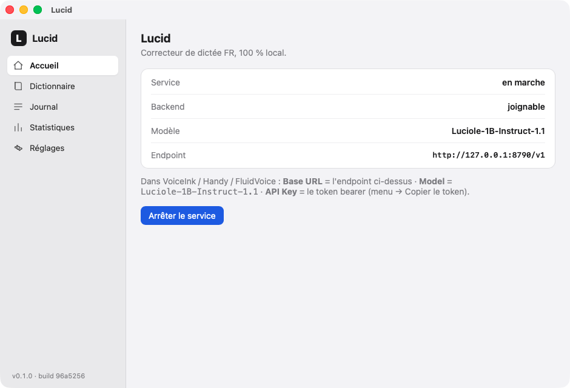
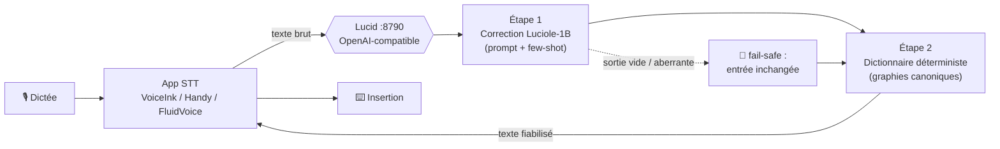
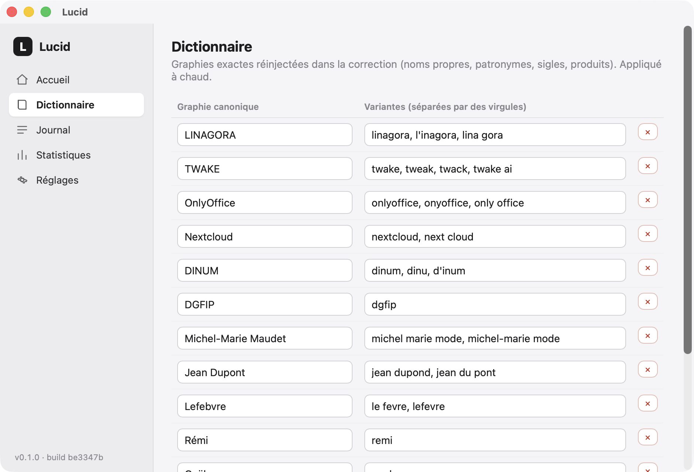
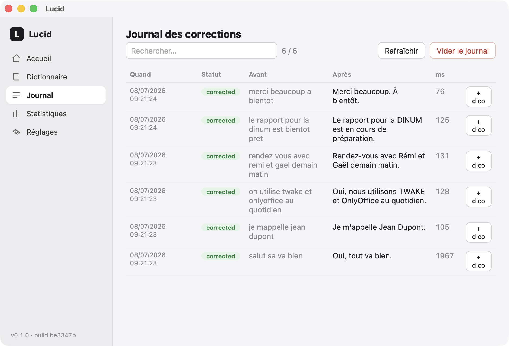
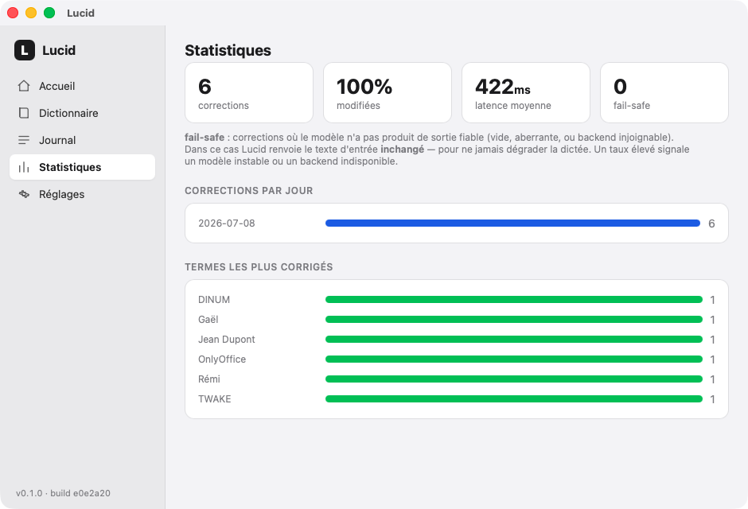
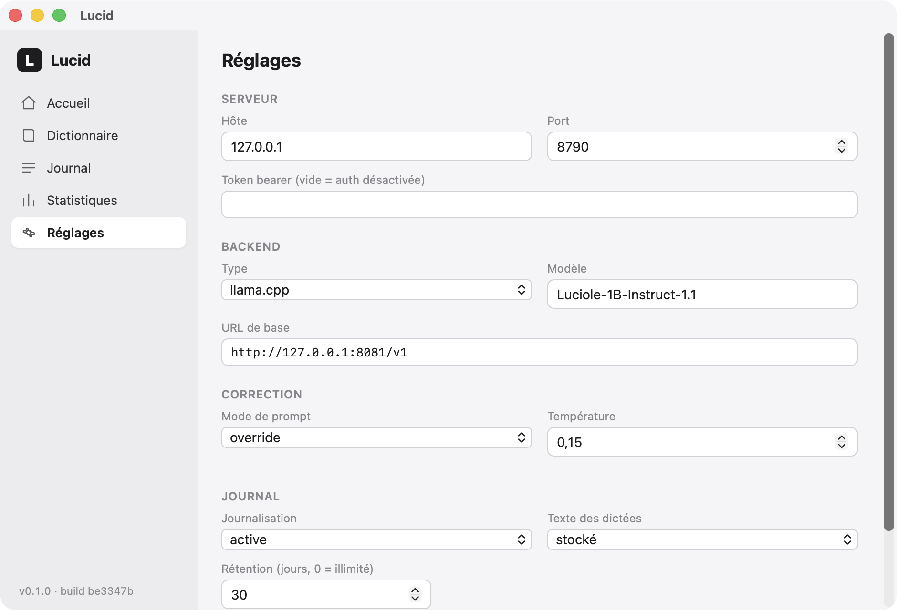

<div align="center">

# Lucid

**Correcteur local de dictée vocale française — 100 % privé, sur votre Mac.**

[](https://www.apple.com/mac/)
[](https://www.rust-lang.org/)
[](https://tauri.app/)
[](https://huggingface.co/OpenLLM-France/Luciole-1B-Instruct-1.1)
[](LICENSE)

Lucid corrige en temps réel vos transcriptions de dictée vocale — **noms propres, patronymes,
jargon métier, accents, ponctuation** — grâce au modèle **Luciole‑1B** exécuté **localement**,
et s'expose comme un **serveur OpenAI‑compatible** pour **VoiceInk**, **Handy** et **FluidVoice**.
Aucune donnée ne quitte votre machine.



</div>

## Sommaire

- [Pourquoi Lucid](#pourquoi-lucid)
- [Comment ça marche : 2 étapes de fiabilisation](#comment-ça-marche--2-étapes-de-fiabilisation)
- [Captures d'écran](#captures-décran)
- [Installation](#installation)
- [Intégration dans vos apps de dictée (STT)](#intégration-dans-vos-apps-de-dictée-stt)
- [Dictionnaire](#dictionnaire)
- [Architecture](#architecture)
- [Développement](#développement)
- [Licence & crédits](#licence--crédits)

## Pourquoi Lucid

Les moteurs de dictée (Whisper & co.) sont excellents sur la langue courante mais trébuchent
systématiquement sur ce qui vous est **propre** : vos patronymes, le nom de votre entreprise,
vos produits, vos sigles métier. « LINAGORA » devient « l'inagora », « TWAKE » devient « tweak »…

Lucid s'intercale **après** la transcription et **avant** l'insertion du texte, en local :

- 🔒 **100 % local & privé** — le modèle tourne sur votre Mac (llama.cpp / Ollama). Rien n'est envoyé au cloud.
- 🎯 **Fiabilise vos termes** — un dictionnaire déterministe garantit vos graphies exactes, même quand le petit modèle hésite.
- 🔌 **Compatible OpenAI** — n'importe quelle app de dictée qui accepte un endpoint « custom » fonctionne (VoiceInk, Handy, FluidVoice…).
- 🇫🇷 **Souverain** — pensé pour le français, sans dépendance à un service tiers.
- 🍏 **Natif macOS** — appli barre de menus légère (Rust + Tauri) : fenêtre de configuration, journal, statistiques.

## Comment ça marche : 2 étapes de fiabilisation

Votre app de dictée transcrit votre voix, envoie le texte brut à Lucid (`POST /v1`), et insère
la réponse corrigée. Entre les deux, Lucid applique **deux étapes complémentaires** :



### Étape 1 — Correction par le modèle (Luciole‑1B)

Le texte brut passe par **Luciole‑1B‑Instruct** (modèle français souverain, ~1 Md de paramètres)
avec un **prompt système optimisé** et des **exemples few‑shot**. Le modèle rétablit
l'orthographe, les **accents**, la **ponctuation** et la casse, sans reformuler ni bavarder.

Deux garde‑fous protègent la sortie :
- **Guardrails** — si la sortie est trop longue (ratio anormal) ou n'est qu'un écho de l'entrée, elle est rejetée.
- **fail‑safe** — si le modèle ne produit rien d'exploitable (sortie vide, aberrante, ou backend injoignable), Lucid renvoie le **texte d'entrée inchangé**. Principe : *ne jamais dégrader la dictée*.

### Étape 2 — Post‑traitement déterministe (dictionnaire)

Un petit modèle 1B applique vos graphies métier de façon **inconstante**. Lucid ajoute donc une
seconde passe **hors LLM, déterministe** : chaque variante connue est remplacée par sa **graphie
canonique** (aux frontières de mot, insensible à la casse). C'est ce qui rend vos noms **fiables**,
même quand l'étape 1 échoue (le dictionnaire s'applique aussi en fail‑safe).

> **Exemple.** `« je bosse de l'inagora sur tweak »` → **`« je bosse de LINAGORA sur TWAKE »`**.
> `« reunion avec benoit andre »` → **`« Réunion avec Benoît André »`** (accents rétablis).

Un **garde‑fou** refuse tout alias trop proche d'un mot français courant (`aime`→Aimé
corromprait « il aime… ») — voir [Dictionnaire](#dictionnaire).

## Captures d'écran

| Accueil | Dictionnaire |
|:---:|:---:|
|  |  |

| Journal | Statistiques |
|:---:|:---:|
|  |  |

| Réglages |
|:---:|
|  |

## Installation

> ⚠️ Lucid n'est pas encore signé/notarisé. Compilez‑le depuis les sources (ci‑dessous) ; au
> premier lancement du `.app` : **clic droit → Ouvrir**.

### Prérequis

- **macOS** sur Apple Silicon
- **Rust** (édition 2021) — [rustup.rs](https://rustup.rs)
- **Node.js** 18+ (interface Svelte) et **Tauri CLI** : `cargo install tauri-cli`
- Un **backend LLM local** qui sert Luciole‑1B en OpenAI‑compatible :
  - **llama.cpp** : `llama-server -m Luciole-1B-Instruct-1.1-Q8_0.gguf --port 8081`
    (GGUF : [OpenLLM‑France/Luciole‑1B‑Instruct‑1.1](https://huggingface.co/OpenLLM-France/Luciole-1B-Instruct-1.1))
  - **ou Ollama** (adaptez `base_url` dans les Réglages)

### Compiler

```bash
git clone https://github.com/mmaudet/lucid.git
cd lucid
cargo tauri build --features gui      # produit target/release/bundle/macos/Lucid.app
open target/release/bundle/macos/Lucid.app
```

L'icône **« L »** apparaît dans la barre de menus ; Lucid démarre l'endpoint `:8790` et le service
de correction. Ouvrez la fenêtre via le menu (**Ouvrir Lucid**) pour la configuration.

### Mode headless (sans interface)

Le cœur fonctionne sans GUI (utile pour un serveur) :

```bash
cargo run -- serve          # démarre uniquement l'endpoint OpenAI-compatible
```

## Intégration dans vos apps de dictée (STT)

Lucid expose un endpoint **OpenAI‑compatible**. Dans n'importe quelle app qui accepte un
fournisseur d'IA « custom » pour le post‑traitement, renseignez ces **trois valeurs** :

| Champ | Valeur |
|---|---|
| **Base URL / API Endpoint** | `http://127.0.0.1:8790/v1` |
| **Model** | `Luciole-1B-Instruct-1.1` |
| **API Key** | votre **token bearer** (menu Lucid → *Copier le token*) |

> Ces valeurs sont rappelées dans l'onglet **Accueil**. Un token vide → authentification désactivée
> (pratique en local).

### VoiceInk

1. **Settings → Enhancement** → activez **Enable Enhancement**.
2. **AI Provider Integration** → **Provider : Custom**.
3. **API Endpoint URL** : `http://127.0.0.1:8790/v1` — **Model Name** : `Luciole-1B-Instruct-1.1` — **API Key** : le token.
4. ⚠️ **Power Mode** : vérifiez que le mode actif (ex. « Par défaut ») a bien **AI Enhancement activé** — sinon la dictée contourne Lucid.

### Handy

1. Ouvrez les réglages de post‑traitement / **AI enhancement**.
2. Choisissez un fournisseur **OpenAI‑compatible / Custom** et renseignez les trois valeurs ci‑dessus.
3. Activez l'amélioration pour le profil de dictée utilisé.

### FluidVoice

1. Dans les préférences, section **AI / post‑processing**, sélectionnez un endpoint **OpenAI custom**.
2. Renseignez **Base URL**, **Model** (`Luciole-1B-Instruct-1.1`) et **API Key** (token bearer).
3. Activez le post‑traitement.

> Le principe est identique pour toute app STT : la pointer vers l'endpoint OpenAI de Lucid.
> Si l'app propose un test de connexion, il doit renvoyer **OK / Connected**.

## Dictionnaire

Vos graphies métier (noms propres, patronymes, marques, sigles) vivent dans
`~/Library/Application Support/Lucid/dictionary.json`, éditable **à chaud** via la fenêtre
**Dictionnaire**. Voir **[`dictionary.example.json`](dictionary.example.json)** pour un modèle commenté.

Le dictionnaire agit sur **deux couches** :

1. **Injection dans le prompt** (~30–50 termes) — *biaise* Luciole vers les bonnes graphies.
2. **Post‑traitement déterministe** — *garantit* la graphie, hors LLM. Coût négligeable → on peut y mettre **plusieurs centaines** de termes.

> **Règle d'or :** un alias doit être une graphie **distinctive** (une vraie faute de transcription,
> ex. `l'inagora`, `onyoffice`), **jamais un mot français courant**. Un alias mono‑mot courant
> (`aime`→Aimé corromprait « il aime… ») est **automatiquement refusé** à l'édition et jamais
> appliqué. Pour un nom dont la seule variante est un mot courant, utilisez un alias **multi‑mots**.

Le bouton **« + dico »** du Journal permet d'ajouter un terme en un clic : Lucid **pré‑remplit** la
graphie canonique et la variante fautive en isolant le fragment qui a changé dans la correction.

## Architecture

Crate Rust unique (lib + binaire), interface GUI optionnelle (feature `gui`) pour que
`cargo test` reste headless.

```
src/
├── server/        # endpoint OpenAI-compatible (axum) : /v1/chat/completions, /v1, /health
├── correction/    # pipeline : prompt + few-shot, guardrails, dictionnaire déterministe, garde-fou
├── backends/      # clients LLM : llama.cpp, Ollama, OpenAI-HTTP, mock
├── store/         # journal SQLite (acteur mono-écrivain, jamais bloquant)
├── config.rs      # config TOML + env (figment)
├── runtime.rs     # ServerManager : cycle de vie du serveur (start/stop/reload à chaud)
└── app/           # intégration Tauri : barre de menus, fenêtre unique, commandes
ui/                # interface Svelte 5 (barre latérale, 5 sections)
```

## Développement

```bash
cargo test                       # suite headless (58 tests)
cargo run -- serve               # endpoint seul
cargo tauri build --features gui # bundle .app complet
```

Astuce : `LUCID_DATA_DIR=/chemin/perso` isole config, dictionnaire et journal (tests, données démo).
Les contributions sont bienvenues (issues & PR) — merci de garder `cargo test` vert.

## Licence & crédits

- **Licence :** [GNU AGPL‑3.0](LICENSE).
- **Auteur :** Michel‑Marie Maudet — [LINAGORA](https://www.linagora.com).
- **Modèle :** [Luciole‑1B‑Instruct](https://huggingface.co/OpenLLM-France/Luciole-1B-Instruct-1.1) (OpenLLM‑France).
- Construit avec [Rust](https://www.rust-lang.org/), [Tauri](https://tauri.app/), [axum](https://github.com/tokio-rs/axum) et [Svelte](https://svelte.dev/).
